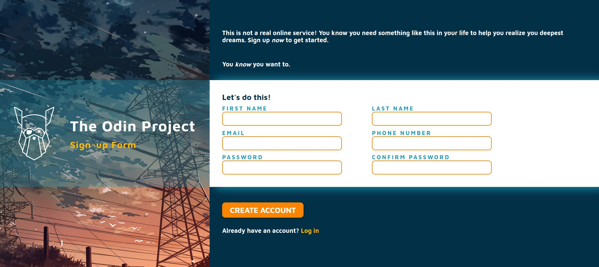

# Project: Sign-up Form
This project is intended to give you a chance to flex some of the new items you’ve been absorbing over the past few lessons. This time it’s a sign-up form for an imaginary service. The first project for [Intermediate HTML and CSS Course](https://www.theodinproject.com/paths/full-stack-javascript/courses/intermediate-html-and-css) at [The Odin Project](https://www.theodinproject.com/).

## Table of contents
- [Introduction](#introduction)
- [Overview](#overview)
  - [Screenshot](#screenshot)
  - [Built using](#built-using)
  - [Lessons Applied](#lessons-applied)
- [Author](#author)
- [Acknowledgement](#acknowledgement)
## Introduction
- This is my solution to the first project for Intermediate HTML and CSS Course.
- This webpage is a simple sign-up form, with some simple dummy content and functionalities such as:
    - Checking if the password fields match each other.

## Overview
- Link: [github.com/kierhb/top-sign-up-form](https://github.com/kierhb/top-sign-up-form)

### Screenshot

### Built using

- HTML5 markup
- CSS
- Vanilla JavaScript

### Lessons Applied:

- for HTML:
    - Form Basics
    - Form Validations
- for CSS:
    - CSS Units
    - Online Font Libraries
    - Text Styles
    - Background, Border-radius, Box shadow and Opacity
    - Advance Selectors
    - Positioning
    - CSS Functions
    - Custom Properties

## Author

- GitHub - [@kierhb](https://github.com/kierhb)
- LinkedIn - [Kier Bobila](https://www.linkedin.com/in/kier-bobila/)

## Acknowledgement
I want to acknowledge all members of The Odin Project community.